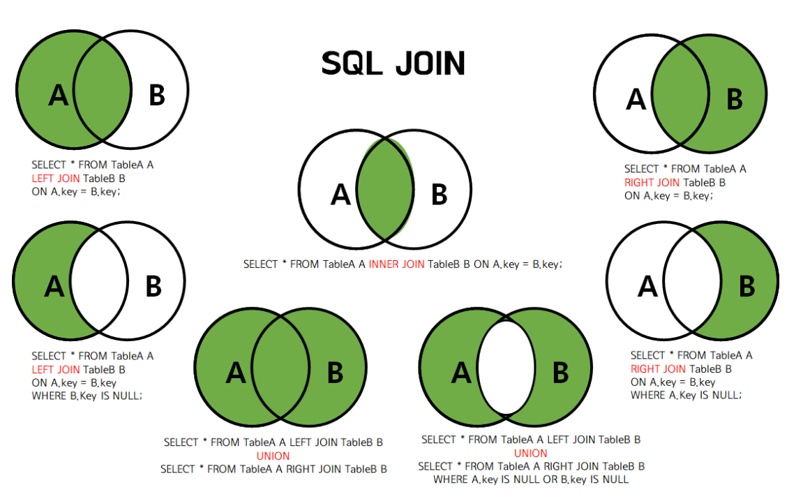

# 코딩테스트 SQL 문법 정리

## 목차

- [SQL 쿼리 순서](#sql-쿼리-순서)
- [SQL JOIN](#sql-join)
- [연산자](#연산자)
- [조건](#조건)
- [숫자](#숫자)
- [문자열](#문자열)
- [날짜 / 시간](#날짜--시간)
- [기타](#기타)

---

## SQL 쿼리 순서

### 적는 순서

```
1. SELECT 컬럼
2. FROM 테이블
3. JOIN 다른 테이블 ON 조건
4. WHERE 조건
5. GROUP BY 컬럼
6. HAVING 그룹 조건
7. ORDER BY 정렬 기준
8. LIMIT 개수 OFFSET 시작 위치
```

### 실행 순서

```
1. FROM
2. JOIN ~ ON ~
3. WHERE
4. GROUP BY
5. HAVING
6. SELECT / DISTINCT
7. ORDER BY
8. LIMIT / OFFSET
```

---

## SQL JOIN



---

## 연산자

### [산술 연산자](https://dev.mysql.com/doc/refman/8.4/en/non-typed-operators.html)

- `+`
- `-`
- `*`
- `/`
- `%`
- `&`
- `|`
- `~`

### [비교 연산자](https://dev.mysql.com/doc/refman/8.4/en/comparison-operators.html)

- `=`
- `!=`, `<>`
- `>`
- `<`
- `>=`
- `<=`

### [논리 연산자](https://dev.mysql.com/doc/refman/8.4/en/logical-operators.html)

- `AND`
- `OR`
- `NOT`

### [`expr BETWEEN min AND max`](https://dev.mysql.com/doc/refman/8.4/en/comparison-operators.html#operator_between)

- `min <= expr AND expr <= max`와 동일하며 조건을 만족하면 1, 아니면 0 반환

### [`IS NULL`](https://dev.mysql.com/doc/refman/8.4/en/comparison-operators.html#operator_is-null), [`IS NOT NULL`](https://dev.mysql.com/doc/refman/8.4/en/comparison-operators.html#operator_is-not-null)

- `NULL` 여부에 대한 비교에서 사용하며 조건을 만족하면 1, 아니면 0 반환

### [`ISNULL(expr)`](https://dev.mysql.com/doc/refman/8.4/en/comparison-operators.html#function_isnull)

- `expr`이 `NULL`이면 1, 아니면 0 반환

### [`expr LIKE Pattern`](https://dev.mysql.com/doc/refman/8.4/en/string-comparison-functions.html#operator_like)

- `expr`과 `Pattern`에 대한 패턴 매칭이 되면 1, 아니면 0 반환

### `LIKE` 연산자 와일드 카드

- `_` -> 1개의 문자
- `%` -> 0개 이상의 문자

```SQL
"test_"
"_test"
"_test_"
"test%"
"%test"
"%test%"
```

---

## 조건

### [`IF(expr1, expr2, expr3)`](https://dev.mysql.com/doc/refman/8.4/en/flow-control-functions.html#function_if)

- `expr1`이 true면 `expr2`, false면 `expr3` 반환

### [`IFNULL(expr1, expr2)`](https://dev.mysql.com/doc/refman/8.4/en/flow-control-functions.html#function_ifnull)

- `expr1`이 null이 아니면 그대로 반환하고 null이면 `expr2` 반환

### [`CASE`](https://dev.mysql.com/doc/refman/8.4/en/flow-control-functions.html#operator_case)

- 조건 분기

```SQL
CASE value
  WHEN value1 THEN result1
  [WHEN value2 THEN result2]
  ...
  [ELSE default_result]
END
```

```SQL
CASE
  WHEN condition1 THEN result1
  [WHEN condition2 THEN result2]
  ...
  [ELSE default_result]
END
```

---

## 숫자

### 함수

- [`ROUND(X)`, `ROUND(X, D)`](https://dev.mysql.com/doc/refman/8.4/en/mathematical-functions.html#function_round)
  - 소수점 아래 `D`자리에서 `X`를 반올림(생략시 `D=0`)
- [`FLOOR(X)`](https://dev.mysql.com/doc/refman/8.4/en/mathematical-functions.html#function_floor)
  - `X`보다 작은 가장 큰 정수 반환

---

## 문자열

### 함수

- [`LEFT(str, len)`](https://dev.mysql.com/doc/refman/8.4/en/string-functions.html#function_left)
  - 왼쪽부터 `len`개 문자
- [`RIGHT(str, len)`](https://dev.mysql.com/doc/refman/8.4/en/string-functions.html#function_right)
  - 오른쪽부터 `len`개 문자
- [`SUBSTRING`](https://dev.mysql.com/doc/refman/8.4/en/string-functions.html#function_substring)
  - `SUBSTRING(str, pos)` -> `pos`번 문자부터 끝까지
  - `SUBSTRING(str, pos, len)` -> `pos`번 문자부터 `len`개의 문자
- [`CONCAT(str1, str2, ...)`](https://dev.mysql.com/doc/refman/8.4/en/string-functions.html#function_concat)
  - 여러 문자열을 합침

---

## 날짜 / 시간

### 데이터 타입

- `DATE`
  - 날짜만 저장(YYYY-MM-DD)
- `DATETIME`
  - 날짜와 시간 저장(YYYY-MM-DD HH:MM:SS)

### 함수

- [`YEAR(expr)`](https://dev.mysql.com/doc/refman/8.4/en/date-and-time-functions.html#function_year)
  - `expr`에서 연도 추출
- [`MONTH(expr)`](https://dev.mysql.com/doc/refman/8.4/en/date-and-time-functions.html#function_month)
  - `expr`에서 월 추출
- [`DAY(expr)`](https://dev.mysql.com/doc/refman/8.4/en/date-and-time-functions.html#function_day)
  - `expr`에서 일 추출
- [`HOUR(expr)`](https://dev.mysql.com/doc/refman/8.4/en/date-and-time-functions.html#function_hour)
  - `expr`에서 시 추출
- [`MINUTE(expr)`](https://dev.mysql.com/doc/refman/8.4/en/date-and-time-functions.html#function_minute)
  - `expr`에서 분 추출
- [`SECOND(expr)`](https://dev.mysql.com/doc/refman/8.4/en/date-and-time-functions.html#function_second)
  - `expr`에서 초 추출
- [`QUARTER(expr)`](https://dev.mysql.com/doc/refman/8.4/en/date-and-time-functions.html#function_quarter)
  - `expr`에서 분기 추출
- [`DATE_FORMAT(expr, format)`](https://dev.mysql.com/doc/refman/8.4/en/date-and-time-functions.html#function_date-format)
  - `expr`을 `format`으로 포맷팅
  - `%Y`
    - 4자리 연도
  - `%m`
    - 2자리 월
  - `%d`
    - 일
  - `%H`
    - 시
  - `%i`
    - 분
  - `%s`
    - 초
- [`DATEDIFF(date1, date2)`](https://dev.mysql.com/doc/refman/8.4/en/date-and-time-functions.html#function_datediff)
  - 두 날짜의 차 반환(date1 - date2)

---

## 기타

### [`expr IN (value, ...)`](https://dev.mysql.com/doc/refman/8.4/en/comparison-operators.html#operator_in)

- `expr`이 리스트에 존재하면 1(true), 존재하지 않으면 0(false) 반환
  - ex)
    - `SELECT 2 IN (0, 3, 5, 7)` -> 0
    - `SELECT 'wefwf' IN ('wee','wefwf','weg')` -> 1
- 튜플로 비교도 가능
  - ex)
    - `SELECT (3,4) IN ((1,2), (3,4))` -> 1
    - `SELECT (3,4) IN ((1,2), (3,5))` -> 0
- `expr NOT IN (value, ...)`로 사용 가능

### [`operand IN (subquery)`](https://dev.mysql.com/doc/refman/8.4/en/any-in-some-subqueries.html)

- 서브쿼리 결과 집합에 사용 가능

---
